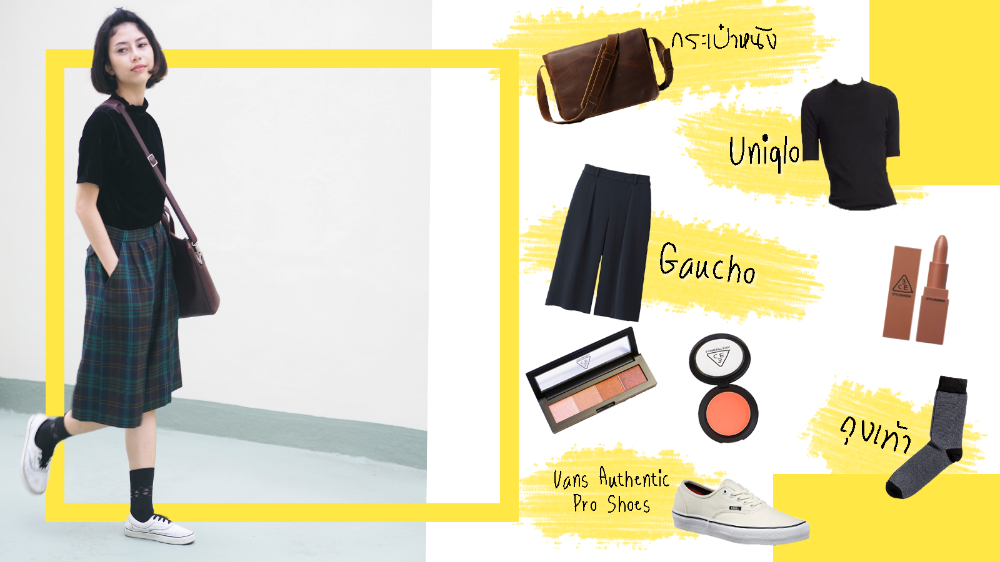

# amp
<!DOCTYPE html>
<html>
<title>amp style</title>
<meta charset="UTF-8">
<meta name="viewport" content="width=device-width, initial-scale=1">
<link rel="stylesheet" href="w3.css">
<link rel="stylesheet" href="w4.css">
<link rel="stylesheet" href="w5.css">
<link rel="stylesheet" href="https://cdnjs.cloudflare.com/ajax/libs/font-awesome/4.7.0/css/font-awesome.min.css">

<body class="w3-white">

<!-- Navigation bar with social media icons -->

  <a href="https://chalobon.github.io/Home/" class="w3-bar-item w3-button"><i class="fa fa-home"></i> HOME</a>
  <a href="https://chalobon.github.io/Celebrity/" class="w3-bar-item w3-button"><i class="fa fa-star"></i> CELEBRITY FASHION</a>
  <a href="https://chalobon.github.io/Contact/" class="w3-bar-item w3-button"><i class="fa fa-user"></i> CONTACT</a>
  <a href="https://www.google.com" class="w3-bar-item w3-button w3-right"><i class="fa fa-search"></i> GOOGLE SEARCH</a>

<!-- w3-content defines a container for fixed size centered content,
and is wrapped around the whole page content, except for the footer in this example -->

  <!-- Header -->
  <header class="w3-container w3-center w3-padding-48 w3-white">
   
    <h6>Welcome to PSU world</h6>
  </header>
  
  <!-- Image header -->
  <header class="w3-display-container w3-wide w3-center" id="home">
    
  </header>
   

  <!-- Page Container -->

  <!-- The Grid -->
 

   <!-- Left Column -->
   

     

       

         

       

       

          
<b><i class="w3-large w3-text-theme"></i>Chanikan Sai-ngam</b>

          
<i class="fa fa-home fa-fw w3-margin-right w3-large w3-text-teal"></i>FACULTY: Management Science

          
<i class="fa fa-star fa-fw w3-margin-right w3-large w3-text-teal"></i>AGE: 22

          
<i class="fa fa-instagram fa-fw w3-margin-right w3-large w3-text-teal"></i>amp_bodyslam

           
<i class="fa fa-facebook fa-fw w3-margin-right w3-large w3-text-teal"></i>Amp Amp

         

         
<b><i class="w3-large w3-text-theme"></i>INSPIRATION</b>

         
<i class="fa fa-heart fa-fw w3-margin-right w3-large w3-text-teal"></i> ส่วนใหญ่มาขากภาพยนต์ค่ะ ที่มีความชัดเจนของยุคแฟชั่น วัฒนธรรม อาจจะเป็นยุค90ของไทย แต่ช่วงนี้ติดไปทางญี่ปุ่นหน่อย 

         

         
<b><i class="w3-large w3-text-theme"></i>SOCIAL MEDIA (LINK) </b>

         
<b><i class="fa fa-facebook-official w3-margin-right"></i>
        <a href="https://www.facebook.com/Chanikarn.Saingam" target="_blank">Facebook</a>
        
<b><i class="fa fa-instagram w3-margin-right"></i>
        <a href="https://www.instagram.com/amp_bodyslam/" target="_blank">Instagram</a>
         
        

         
<b><i class="w3-margin-right w3-text-teal"></i>POPULAR</b>

            <ul class="w3-ul w3-hoverable w3-gray">
          <li class="w3-padding-16">
            
            Wantani
             

          </li>
          <li class="w3-padding-16">
            
            Tunwarat
             

          </li>
          <li class="w3-padding-16">
            
            Tharit
             

          </li>
          <li class="w3-padding-16">
            
            Nurichcha
             

          </li>
          <li class="w3-padding-16">
            
            Chanikan
             

          </li>
          <li class="w3-padding-16">
             
            Anupong
             

          </li>
        </ul>
 
        

      
 

   <!-- End Left Column -->
   

   <!-- Right Column -->
   

     <!-- Grid for photos -->
   

     

       
       
       
       
       
     

     

       
       
       
       
       

     

   <!-- End photo grid -->
   

         

   <!-- End Right Column -->
   

 <!-- End Grid -->
 

 <!-- End Page Container -->

<!-- Footer -->
<footer class="w3-container w3-padding-64 w3-black w3-center w3-opacity w3-xlarge" style="margin-top:128px">
  <i class="fa fa-facebook-official w3-hover-opacity"></i>
  <i class="fa fa-instagram w3-hover-opacity"></i>
  <i class="fa fa-snapchat w3-hover-opacity"></i>
  <i class="fa fa-pinterest-p w3-hover-opacity"></i>
  <i class="fa fa-twitter w3-hover-opacity"></i>
  <i class="fa fa-linkedin w3-hover-opacity"></i>
  
Powered by <a href="https://www.w3schools.com/w3css/default.asp" target="_blank" class="w3-hover-text-yellow">w3.css</a>

</footer>

</body>
</html>
